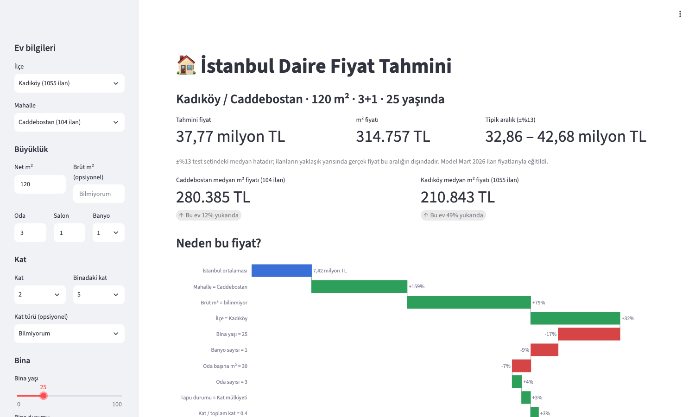
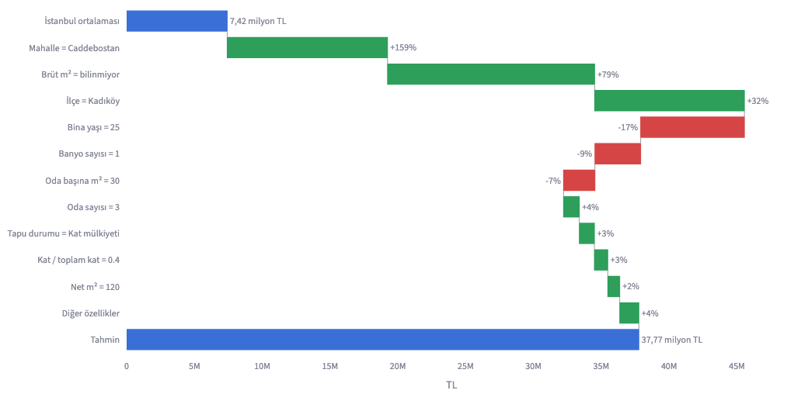
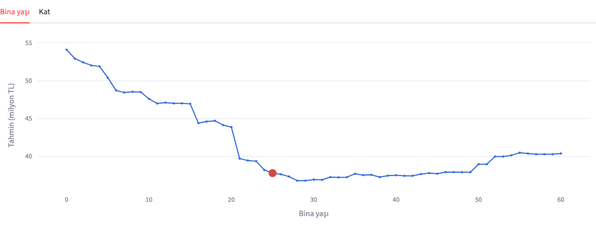
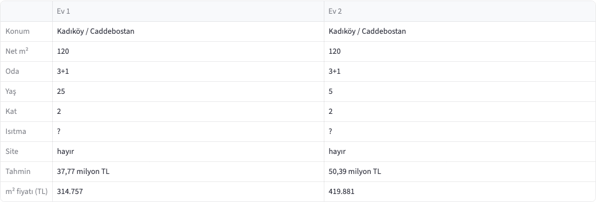
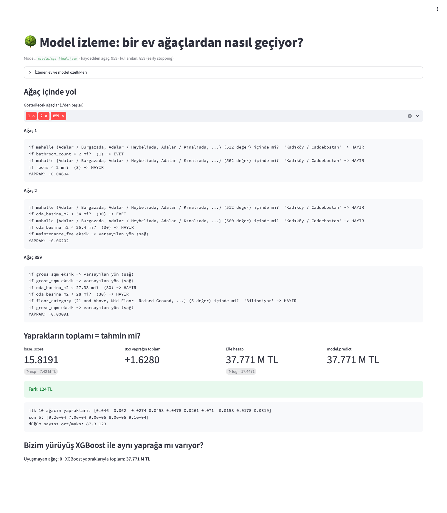
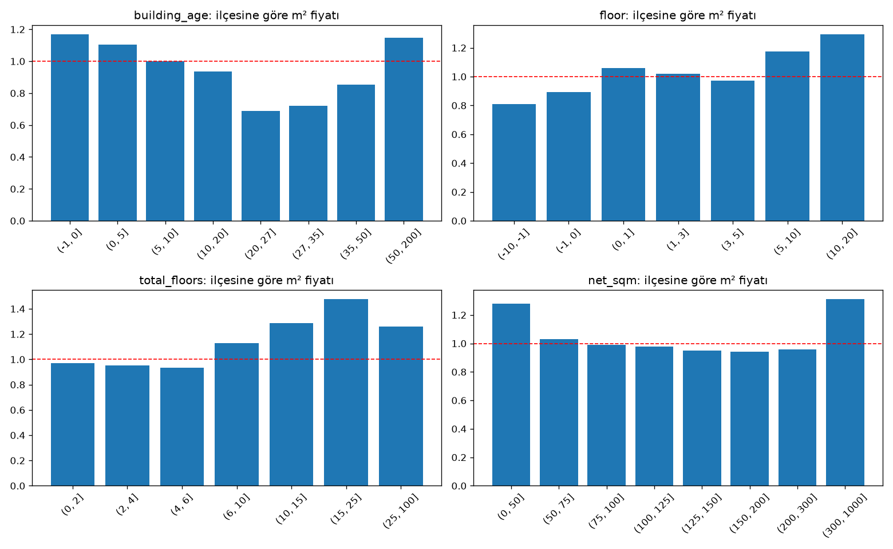
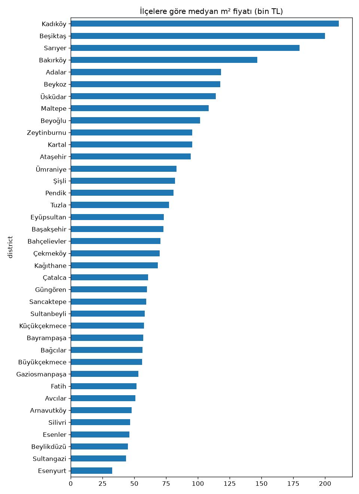

# İstanbul Daire Fiyatı Tahmini: XGBoost ile Uçtan Uca Proje

İstanbul'daki satılık daire ilanlarından bir XGBoost modeli eğitir ve yeni bir dairenin ilan fiyatını **medyan %13 hata** ile tahmin eder. Basit bir "mahallenin m² fiyatı × metrekare" hesabının hatası %23'tür; model bu hatayı neredeyse yarıya indirir.

Veri, Mart 2026'da Hepsiemlak'tan toplanmış 24.767 ilandan oluşur. Temizlikten sonra 38 ilçe, 740 mahalle ve 2.395 emlak ofisinden 24.119 ilan kaldı. Model 37 özellik kullanır ve her tahminini özellik özellik açıklayabilir.



<sub>Web arayüzü (`streamlit run app.py`). Tüm sayfa: [`docs/img/app_tam_sayfa.png`](docs/img/app_tam_sayfa.png)</sub>

## İçindekiler

- [Hızlı başlangıç](#hızlı-başlangıç)
- [Demo](#demo)
- [Proje yapısı](#proje-yapısı)
- [Adımlar ve sonuçlar](#adımlar-ve-sonuçlar)
- [XGBoost nasıl çalışır?](#xgboost-nasıl-çalışır)
- [Veri seti ve alanlar](#veri-seti-ve-alanlar)
- [Adım 1: Veri temizliği](#adım-1-veri-temizliği)
- [Adım 2: Keşifsel analiz](#adım-2-keşifsel-analiz)
- [Adım 3: Özellik mühendisliği](#adım-3-özellik-mühendisliği)
- [Adım 4: Eğitim](#adım-4-eğitim)
- [Adım 5: Değerlendirme ve yorumlama](#adım-5-değerlendirme-ve-yorumlama)
- [Adım 6: İyileştirme](#adım-6-iyileştirme)
- [Adım 7: Modeli kullanmak](#adım-7-modeli-kullanmak)
- [Öğrenilen dersler ve sonraki adımlar](#öğrenilen-dersler-ve-sonraki-adımlar)

---

## Hızlı başlangıç

Python 3.10 – 3.13 önerilir. Kurulum yalnızca bir kez yapılır:

```bash
cd evtahmin
python3.13 -m venv venv
./venv/bin/python -m pip install -r requirements.txt
```

Web arayüzünü açmak için (model ve veri depoda hazır, eğitim gerekmez):

```bash
./venv/bin/streamlit run app.py          # http://localhost:8501
```

> **macOS / Homebrew notları**
> - `pip` komutu genelde tanımlı değildir (`zsh: command not found: pip`); her zaman `python -m pip ...` kullanın.
> - Homebrew'un varsayılan `python3` sürümü (3.14) ile sanal ortam kurulurken hata alınabilir; bu yüzden `python3.13` kullanıyoruz.
> - Paketleri sistem Python'una kurmayın (`externally-managed-environment` hatası); kurulumu her zaman `venv` içine yapın.

İsterseniz sanal ortamı etkinleştirip `./venv/bin/` önekini atlayabilirsiniz: `source venv/bin/activate` (Windows: `venv\Scripts\activate`).

---

## Demo

### Web arayüzü (`app.py`)

Solda evin özellikleri seçilir; sağda tahmin, tipik aralık ve mahalle/ilçe medyanına göre konum görünür.

**Neden bu fiyat?** SHAP şelale grafiği tahmini özellik özellik açıklar: İstanbul ortalamasından (7,42 M TL) başlar, en etkili 10 özelliğin fiyatı yüzde kaç ittiğini gösterir ve tahminle biter.



**Ya şöyle olsaydı?** Diğer her şey sabitken yalnızca bina yaşı (ya da kat) değişirse tahmin nasıl değişir? Kırmızı nokta mevcut ev. 20 yaş civarındaki uçurum, analizde görülen 1999 depremi kırılmasıdır.



**Karşılaştırma:** "Karşılaştırmaya ekle" ile en fazla 5 ev yan yana konur. Aynı ev, yalnızca bina yaşı 25'ten 5'e inince:



### Model izleme (`izle.py`)

```bash
./venv/bin/streamlit run izle.py
```

Modeli kara kutu olmaktan çıkarır: örnek bir evin seçilen ağaçlarda hangi sorulardan geçip hangi yaprağa vardığını satır satır gösterir, sonra `base_score` + 859 yaprağın toplamını elle hesaplayıp `model.predict` ile karşılaştırır. Son bölüm, bu elle yürüyüşün 859 ağacın hepsinde XGBoost'un kendi `pred_leaf` sonucuyla aynı yaprağa vardığını doğrular.



Okurken dikkat:
- **Kategorik bölmeler** "mahalle {…} (512 değer) içinde mi?" biçimindedir; kümedeki değerler sağ dala gider.
- **Eksik değerler** (ör. brüt m² girilmediyse) her bölmede eğitimde öğrenilmiş varsayılan yöne gider.
- **Yaprak değerleri** log ölçeğindedir ve öğrenme oranıyla çarpılmış haldedir; ilk ağaçlar ~0,05, son ağaçlar ~0,001 katkı verir.
- 124 TL'lik fark, elle toplamanın float64, XGBoost'un float32 kullanmasından gelir.

### Ekran görüntülerini yenilemek

```bash
./venv/bin/python -m pip install playwright && ./venv/bin/python -m playwright install chromium   # bir kez
./venv/bin/python scripts/ekran_goruntuleri.py
```

Script iki uygulamayı arka planda başlatır, Playwright ile açar (karşılaştırma tablosunu doldurmak için iki ev ekler) ve görüntüleri `docs/img/` klasörüne yazar.

---

## Proje yapısı

```
evtahmin/
├── app.py                   # Streamlit web arayüzü: tahmin, açıklama, "ya şöyle olsaydı?"
├── api.py                   # FastAPI tahmin servisi (POST /tahmin)
├── izle.py                  # Model izleme: bir ev ağaçlardan nasıl geçiyor?
├── requirements.txt
├── scripts/
│   └── ekran_goruntuleri.py # README ekran görüntülerini Playwright ile üretir
├── docs/img/                # README ekran görüntüleri
├── src/                     # Tüm pipeline kodu
│   ├── yollar.py            # Klasör/dosya yolları TEK yerde
│   ├── clear_data.py        # Adım 1: veri temizliği
│   ├── analiz.py            # Adım 2: keşifsel analiz
│   ├── ozellik.py           # Adım 3: özellik mühendisliği
│   ├── iyilestirme.py       # Adım 6: parametre ayarı ve final model
│   └── tahmin.py            # Adım 7: yeni evler için tahmin ve açıklama
├── data/
│   ├── raw/                 # Ham (dokunulmamış) veri
│   ├── processed/           # Temiz veri + çıkarılan satırlar
│   └── features/            # Modele giren özellikler
├── models/
│   ├── xgb_final.json       # Final model (arayüz ve API bunu kullanır)
│   ├── final_ayarlar.json
│   └── baseline/            # 4. adım modeli ve eğitim/doğrulama/test ayrımı (ayrim.json)
├── plots/                   # Analiz grafikleri
└── reports/                 # Her adımın raporu, açıklamalar ve test tahminleri
```

Scriptler proje kök klasöründen **modül olarak** çalıştırılır. Her adım bir öncekinin çıktısını okur:

```bash
./venv/bin/python -m src.clear_data         # 1. temizlik     -> data/processed/
./venv/bin/python -m src.analiz             # 2. analiz       -> plots/, reports/
./venv/bin/python -m src.ozellik            # 3. özellikler   -> data/features/
./venv/bin/python -m src.iyilestirme        # 6. final model  -> models/, reports/  (modeli YENİDEN eğitir)
./venv/bin/python -m src.tahmin --kontrol   # 7. tahmin kodu eğitimle tutarlı mı? -> BAŞARILI
./venv/bin/streamlit run app.py
```

- Temizlik kuralları değişirse zincir o adımdan itibaren yeniden çalıştırılmalıdır.
- `iyilestirme.py`, 4. adımın `models/baseline/ayrim.json` dosyasındaki ayrımı kullanır.
- Bir dosyanın yeri değişirse yalnızca `src/yollar.py` güncellenir.

> **Not:** 4. adım (`egitim.py`) ve 5. adım (`degerlendirme.py`) scriptleri bu depoda yok; 4. adımın çıktıları (`models/baseline/`, `reports/egitim_raporu.txt`) mevcuttur.

---

## Adımlar ve sonuçlar

| Adım | Dosya | Ne yapar? | Ana çıktı |
| --- | --- | --- | --- |
| 1. Temizlik | `src/clear_data.py` | Hatalı ve tekrar eden ilanları ayıklar, kurtarılabilen değerleri düzeltir | `data/processed/temiz_veri.csv` |
| 2. Analiz | `src/analiz.py` | Veriyi okur, ilişkileri inceler; veriyi değiştirmez | `reports/analiz_raporu.txt`, `plots/` |
| 3. Özellik | `src/ozellik.py` | Ham alanlardan modele verilecek özellikleri üretir | `data/features/ozellikler.csv` |
| 4. Eğitim | `egitim.py` *(depoda yok)* | Veriyi ofise göre böler, taban modeli ve XGBoost'u eğitir | `models/baseline/xgb_model.json` |
| 5. Değerlendirme | `degerlendirme.py` *(depoda yok)* | Modelin neye baktığını ve nerede yanıldığını açıklar | — |
| 6. İyileştirme | `src/iyilestirme.py` | Parametreleri ayarlar, final modeli teste bir kez sokar | `models/xgb_final.json` |
| 7. Kullanım | `src/tahmin.py`, `app.py` | Yeni bir evin fiyatını tahmin eder ve açıklar | Web arayüzü |

Test setindeki (modelin hiç görmediği 4.528 ilan) sonuçlar:

| Ölçü | Taban model | İlk XGBoost (4. adım) | Final XGBoost (6. adım) |
| --- | --- | --- | --- |
| Medyan hata | %23,4 | %13,3 | **%13,1** |
| Tahmini ±%10 içinde olan ilan | %23,0 | **%40,2** | %39,8 |
| Tahmini ±%20 içinde olan ilan | %43,6 | %66,3 | **%67,2** |
| Ortalama mutlak hata | 4,06 M TL | 2,64 M TL | **2,56 M TL** |
| R² (log fiyat) | 0,715 | 0,896 | — |

---

## XGBoost nasıl çalışır?

XGBoost tek büyük bir model kurmaz; çok sayıda küçük karar ağacını **sırayla** kurar ve her yeni ağaç, öncekilerin toplamının yaptığı hatayı düzeltmeye çalışır. Son tahmin, başlangıç değeri ile tüm ağaçların katkılarının toplamıdır:

$$\hat{y} = \text{başlangıç} + \eta \cdot f_1(x) + \eta \cdot f_2(x) + \dots + \eta \cdot f_n(x)$$

η (öğrenme oranı) her ağacın katkısını küçültür; model temkinli ve adım adım öğrenir. Random Forest ağaçları birbirinden bağımsız kurup oylama yapar; boosting ise her ağacı bir öncekinin hatasına göre kurar.

> Bunu gerçek modelde görmek için: `./venv/bin/streamlit run izle.py` ([ekran görüntüsü](#model-izleme-izlepy)). Örnek bir evin 859 ağacın her birinde hangi yoldan geçtiğini ve `base_score` + yaprakların toplamının `model.predict` ile aynı olduğunu gösterir.

### Dört evlik örnek

| Ev | m² | Gerçek fiyat (M TL) |
| --- | --- | --- |
| A | 60 | 2 |
| B | 80 | 3 |
| C | 120 | 5 |
| D | 150 | 6 |

**Adım 1: Başlangıç tahmini.** Model henüz hiçbir şey bilmediği için dört eve de aynı sayıyı söyler. Kare hatayı en küçük yapan sabit sayı ortalamadır: (2 + 3 + 5 + 6) / 4 = 4.

| Herkese söylenen | Hatalar (gerçek − tahmin) | Kareler toplamı |
| --- | --- | --- |
| 3 | −1, 0, +2, +3 | 14 |
| **4** | −2, −1, +1, +2 | **10** |
| 5 | −3, −2, 0, +1 | 14 |
| 6 | −4, −3, −1, 0 | 26 |

Her evin hatasına **artık** denir ve bir düzeltme talimatı gibi okunur: A için −2 "tahminimi 2 düşür", D için +2 "tahminimi 2 artır" demektir. Sonraki ağaç fiyatı değil, bu artıkları tahmin etmeye çalışır.

Başlangıç değeri 6 da seçilebilirdi; model yine aynı noktaya varır, ama ilk ağaçlar "herkesi aşağı çek" düzeltmesiyle harcanır. Simülasyonda 4 ile başlayan model 10 ağaçta hatayı 0,58'e, 6 ile başlayan 0,73'e indirdi; 20 ağaçta ikisi eşitlendi. XGBoost'ta bu değerin adı `base_score`'dur.

**Adım 2: Ağacın bölmeyi seçmesi.** Ağaç "m² < X mi?" sorusuyla evleri iki gruba ayırır ve her gruba ortak bir düzeltme uygular. İyi bir soru, aynı yönde düzeltme isteyen evleri bir araya getirir. XGBoost bunu **benzerlik skoru** ile ölçer:

$$\text{Benzerlik} = \frac{(\sum \text{artıklar})^2}{\text{ev sayısı} + \lambda}$$

- **Pay:** Artıklar toplanır; aynı yöndeyse birbirini güçlendirir ({−2, −1} → −3), zıt yöndeyse birbirini götürür ({−2, −1, +1, +2} → 0). Kare alınınca işaret önemini yitirir.
- **Payda:** λ = 0 iken skor, gruba en iyi ortak düzeltme uygulanınca silinen kare hatadır. {−2, −1} için hata 5'ten 0,5'e iner; azalma 4,5 = 9/2.
- **λ (lambda):** Az evli gruplara şüpheyle bakar. Tek evlik bir grubun skoru λ = 1 ile yarıya iner, 100 evlik bir grubunki neredeyse hiç değişmez.

Bölmenin **kazancı** = sol skor + sağ skor − bölmeden önceki skor. λ = 1 ile:

| Soru | Sol grup | Sağ grup | Kazanç |
| --- | --- | --- | --- |
| m² < 70? | {−2} → 2 | {−1, +1, +2} → 1 | 3 |
| **m² < 100?** | {−2, −1} → 3 | {+1, +2} → 3 | **6** |
| m² < 135? | {−2, −1, +1} → 1 | {+2} → 2 | 3 |

Kazanan m² < 100 olur: "düşür" diyenleri bir tarafa, "artır" diyenleri öbür tarafa ayıran tek soru budur. Kazancı γ (gamma) değerinin altında kalan bölmeler budanır.

**Adım 3: Yaprak değerleri ve güncelleme.** Yaprak çıktısı = artıkların toplamı / (ev sayısı + λ). Sol yaprak −3/3 = −1, sağ yaprak +1 olur; λ olmasaydı ±1,5 olurdu. η = 0,3 ile küçük evlerin tahmini 4 − 0,3 = 3,7'ye, büyüklerinki 4,3'e gider ve artıklar −1,7, −0,7, +0,7, +1,7'ye küçülür. İkinci ağaç aynı işlemi bu artıklarla tekrarlar (yaprakları ±0,8) ve 90 m²'lik yeni bir evin tahmini 4 → 3,70 → 3,46 diye ilerler.

**Önemli sınır:** Ağaç tahminleri basamaklıdır ve eğitim verisinin dışına taşamaz. Yeterince ağaçtan sonra 65 m² ile 40 m²'lik ev aynı tahmini alır; 300 m²'lik bir villa, görülen en büyük evin fiyatını alır.

### XGBoost'u farklı kılanlar

- **Düzenlileştirme (λ, γ):** Aşırı öğrenmeye karşı yerleşik fren.
- **İkinci türev (Hessian):** Sınıflandırma gibi genel kayıplarda paydadaki "ev sayısı" yerine kullanılır.
- **Eksik veri desteği:** Her bölmede eksik değerlerin hangi dala gideceğini kendisi öğrenir.
- **Alt örnekleme:** `subsample` satırlardan, `colsample_bytree` sütunlardan rastgele bir kısmı her ağaca verir.
- **Kategorik destek:** "mahalle {Teşvikiye, Moda, Bebek…} içinde mi?" gibi grup soruları sorabilir.

---

## Veri seti ve alanlar

Veri, "Istanbul Apartment Prices 2026" setidir: Hepsiemlak'tan Mart 2026'da toplanmış satılık daire ilanları. Fiyatlar **ilan fiyatıdır**, satış fiyatı değildir; model "bu ev için kaç lira isteniyor?" sorusunu öğrenir, pazarlık payını bilmez.

| Grup | Alanlar | Anlamı ve model için önemi |
| --- | --- | --- |
| Hedef | `price`, `price_per_sqm` | Fiyat log'u alınarak tahmin edilir. `price_per_sqm` = fiyat / net m² olduğu için **modele asla girmez** (hedef sızıntısı) |
| Büyüklük | `net_sqm`, `gross_sqm`, `rooms`, `halls`, `bathroom_count` | Birbirleriyle güçlü ilişkili (net ~ brüt r = 0,96) |
| Konum | `district`, `neighborhood` | İlçe ve mahalle; en güçlü etken |
| Bina | `building_age`, `building_condition`, `building_type`, `total_floors`, `is_in_complex`, `maintenance_fee` | Yaş doğrusal olmayan etki taşır; aidat lüks göstergesi, %63'ü eksik |
| Daire | `floor`, `floor_category`, `orientation`, `heating_type`, `fuel_type`, `furnished`, `usage_status` | Kat "tepe" şeklinde etki eder; cephe tek hücrede birden fazla yön içerebilir ("North, South") |
| Hukuki | `deed_status`, `credit_eligible`, `exchange` | Kat mülkiyeti / kat irtifakı / arsa tapusu / hisseli tapu; kredi uygunluğu |
| İlan | `listing_id`, `last_updated`, `scraped_at` | `listing_id`'nin tireden önceki kısmı emlak ofisini gösterir |
| Bizim eklediklerimiz | `ofis`, `supheli_m2`, `durum_celiskisi` | Temizlikte üretilen gruplama anahtarı ve şüphe işaretleri |

İki alan veri setinin bir özelliğini ortaya çıkardı. `price_per_sqm` sütununun fiyattan hesaplandığı, ilk satırın elle kontrolüyle görüldü: 15.900.000 / 96 = 165.625. `listing_id` ise "42477-549" biçimindedir ve aynı önekli ilanlar aynı ofise aittir; bu bilgi gizli tekrarları bulmak ve veriyi adil bölmek için kullanıldı.

---

## Adım 1: Veri temizliği

`src/clear_data.py` · girdi `data/raw/` · çıktı `data/processed/`, `reports/temizlik_raporu.txt`

Temizlik, 24.767 ilandan 24.119'unu (%97,4) korudu; açık hataları attı, kurtarılabilen değerleri düzeltti ve emin olunamayanları silmeden işaretledi.

### Temel ilke: sil, düzelt ya da işaretle

| Karar | Ne zaman? | Örnekler |
| --- | --- | --- |
| **Sil** | Satır kullanılamaz ya da kesin hatalı | Fiyatı olmayan ilan; 20 m²'den küçük daire; aynı ilanın tekrarı |
| **Düzelt** | Doğru değer güvenle bulunabiliyor | Net > brüt ise yer değiştir; kat boş ama "Top Floor" ise kat = toplam kat; imkânsız kat (99) → eksik |
| **İşaretle** | Emin değiliz | 55 yaşında ama "New" bina → `durum_celiskisi`; net/brüt > 0,95 → `supheli_m2` |

### Adımlar

1. **Biçim:** Metinlerin boşlukları kırpılır; sayı ve tarih sütunları dönüştürülür; "Not Specified" gibi değerler eksik yapılır (ama "No Heating" gerçek bilgi olduğu için kalır).
2. **Zorunlu alanlar:** Fiyatı, m²'si ya da ilçesi olmayan ilan çıkarılır.
3. **Tekrarlar:** Aynı `listing_id` ve aynı evin farklı numarayla girilmesi yakalanır; en güncel ilan kalır.
4. **Metrekare:** Eksik net ya da brüt m², medyan net/brüt oranıyla doldurulur; ters girilenler düzeltilir.
5. **Kat:** Kat türünden kurtarma (Penthouse → en üst kat, Entrance/Garden → 0, Basement → −1); imkânsız değerler eksik yapılır.
6. **Gizli tekrarlar:** Aynı ofis + mahalle + fiyat + brüt m² + oda sayısına sahip ilanlar, kat ve yaşları çelişmiyorsa (eşit ya da biri boş) aynı ev sayılır ve en çok bilgi içeren kalır.
7. **Mantık kontrolleri:** Bina yaşı 0–150, banyo 0–10, aidat 0–200.000 dışındaki değerler eksik yapılır.
8. **Aykırı fiyatlar:** m² fiyatı, **kendi ilçesinin** dağılımına göre 3×IQR dışında kalan ilanlar çıkarılır. 30'dan az ilanlı ilçelerde İstanbul geneli kullanılır.

### Gerçek veriden iki örnek

**Gizli tekrar.** 48848-283 ve 48848-281 ilanları aynı ofisten, aynı mahalleden (Burgazada), aynı fiyat (10 M TL), aynı brüt m² (65) ve aynı oda sayısıyla geldi. Biri "Penthouse" ve kat/yaş boş, diğeri "Top Floor", 3. kat, 30 yaş. Üç katlı binada ikisi aynı yer olduğu için kural 283'ü çıkardı. Aynı ofisin 42477-398 ve 42477-500 ilanları ise farklı kat (0 ve 1) ve yaşta (30 ve 35) olduğu için ikisi de korundu.

**Neden ilçe bazında aykırı değer?** m² başına 400 bin TL Beşiktaş'ta normal olabilir, Esenyurt'ta neredeyse kesin hatadır. Tek bir İstanbul sınırı ya lüks Beşiktaş ilanlarını silerdi ya da Esenyurt'taki hataları kaçırırdı. Sınır bilerek geniş tutuldu (yaygın 1,5×IQR yerine 3×IQR): amaç yalnızca açık hataları atmak.

### Çıktılar

| Dosya | İçerik |
| --- | --- |
| `data/processed/temiz_veri.csv` | Sonraki adımların girdisi |
| `data/processed/cikarilan_satirlar.csv` | Silinen her satır ve `cikarilma_nedeni` |
| `reports/temizlik_raporu.txt` | Her adımda kaç satırın etkilendiği |

Temizlik tek seferde bitmedi. İlk sürüm çıktısının ilk 7 satırı elle incelenince gizli tekrar, "Not Specified" ve Penthouse sorunları fark edildi ve kod güncellendi. Bu yüzden `cikarilan_satirlar.csv` ve temiz verinin ilk satırlarına bakmak temizliğin kendi testidir.

---

## Adım 2: Keşifsel analiz

`src/analiz.py` · çıktı `plots/`, `reports/analiz_raporu.txt` · ayrıntılı yorumlar: [`reports/analiz.md`](reports/analiz.md)

Analiz, fiyatı en çok konumun belirlediğini, bina yaşının 1999 depremiyle ilişkili keskin bir kırılma taşıdığını ve bazı alanların ilk bakışta yanıltıcı olduğunu gösterdi. `analiz.py` veriyi yalnızca okur; modele doğrudan etkisi yoktur, ama modelle ilgili tüm kararları onun raporu belirler.

### Yaşın etkisi düz bir çizgi değil



0–20 yaş arasında fiyat yavaşça düşer; 21–35 yaşta (1991–2005 yapımı) ani bir uçurum vardır; 36 yaş üstü binalar ise tekrar yükselir. Doğrusal bir model bu ilişkiyi tek bir eğime indirirdi; ağaçlar "yaş > 20 mi?", "yaş > 35 mi?" sorularıyla basamakları doğrudan yakalar.

### Konum: ilçe yetmez, mahalle gerekir



En pahalı ilçe Kadıköy'de medyan m² 211 bin TL, en ucuz Esenyurt'ta 32,5 bin TL: 6,5 kat fark. Yalnızca ilçe bilinirse log fiyattaki değişkenliğin %44'ü, ilçe + mahalle bilinirse %63'ü açıklanır. Şişli bunu iyi gösterir: ilçe medyanı 82 bin TL, ama Teşvikiye'de 178 bin, Gülbahar'da 56 bin TL.

%63 biraz iyimserdir: 740 mahalleden 114'ünde 5'ten az ilan var ve iki ilanlı bir mahallenin ortalaması o iki evi ezberler.

### Karıştırıcı değişken tuzağı

Her evin m² fiyatı kendi ilçesinin medyanına bölünerek **göreli fiyat** hesaplandı (1,20 = "ilçesinden %20 pahalı"). Böylece bir özelliğin ilçe etkisinden arınmış etkisi görüldü. Üç alanda ham fark ile ilçe içi fark birbirinden çok ayrıldı:

| Alan | Ham etki | İlçe içi etki | Açıklama |
| --- | --- | --- | --- |
| Yakıt: elektrik | 1,80 | 0,87 | Elektrikli ilanlar Sarıyer ve Adalar'da yoğun; pahalı olan konum |
| Takasa açık | 0,74 | 0,94 | Takas ilanlarının %28'i Beylikdüzü ve Esenyurt'ta |
| Tapu: intifa hakkı | 2,82 | 1,15 | Ham farkın neredeyse tamamı konumdan |

Elektrik örneğinde etki yön değiştirir: ham veride %80 pahalı, aynı ilçe içinde %13 ucuz. Bu, Simpson paradoksunun gerçek bir örneğidir.

### İlçe içinde gerçek etkisi olan alanlar

- **Tapu:** Arsa tapusu 0,54, hisseli tapu 0,55 (neredeyse yarı fiyat). "Tapu yok" 1,29 çıktı; bunların çoğu tapusu henüz çıkmamış yeni projeler.
- **Kredi:** Krediye uygun olmayanlar %27 ucuz.
- **Bina:** İnşaat halinde 1,43, sıfır 1,15, ikinci el 0,90; site içi 1,31.
- **Isıtma (lüks göstergesi):** Merkezi payölçerli 1,40, yerden ısıtma 1,35, soba 0,55.
- **Kat:** Bodrum 0,62–0,67; 10–20. katlar 1,29; ama en üst kat 0,91 ve penthouse 0,85 (az katlı eski binalarda çatı sorunları).
- **Aidat:** İlçe içi fiyatla en güçlü ilişkili sayısal alan (Spearman 0,44), ama %63'ü eksik.

Cephe (tüm yönler 0,99–1,03), eşya durumu ve yapı türü belirgin bir etki göstermedi. Fiyatın çarpıklığı 8,44'ten log dönüşümüyle 0,73'e indi; en pahalı ilan 460 M TL.

### Analizden çıkan kararlar

| Karar | Gerekçe |
| --- | --- |
| Hedef log(fiyat) | Çarpıklık 8,44 → 0,73 |
| Mahalle kullanılır, az ilanlılar gruplanır | İlçe %44, ilçe + mahalle %63 |
| Kat oranı, en üst kat, yer altı özellikleri eklenir | Kat etkisi tepe şeklinde |
| Tapu, kredi, ısıtma, site, aidat modele girer | Güçlü ilçe içi etkiler |
| Aidat eksikliği doldurulmaz | XGBoost eksik değerin dalını kendisi öğrenir |
| Eğitim/test ayırımı ofise göre yapılır | Aynı ofisin benzer ilanları iki tarafa düşmesin |

---

## Adım 3: Özellik mühendisliği

`src/ozellik.py` · çıktı `data/features/`, `reports/ozellik_raporu.txt` · ayrıntılar: [`reports/ozellikler.md`](reports/ozellikler.md)

Bu adım 25 sayısal ve 12 kategorik olmak üzere 37 özellik üretir ve tek bir altın kurala uyar: **hiçbir özellik fiyat kullanılarak hesaplanmaz.**

### Hedef sızıntısı neden bu kadar önemli?

Hedef sızıntısı, modelin tahmin anında bilemeyeceği bir bilgiyi eğitimde görmesidir. Model test setinde harika görünür, gerçek hayatta işe yaramaz. Projede iki biçimi vardı:

- **Açık sızıntı:** `price_per_sqm` = fiyat / net m². Modele verilseydi fiyatı tahmin etmek yerine geri hesaplardı.
- **Gizli sızıntı (target encoding):** "Mahallenin ortalama m² fiyatı" tüm veriyle hesaplanırsa test evinin kendi fiyatı da ortalamaya girer. 10–15 ilanlı mahallelerde etkisi büyüktür. Bu tür özellikler ancak eğitim/test ayrımından **sonra**, yalnızca eğitim verisiyle hesaplanabilir.

### Üretilen özellikler

| Grup | Özellikler | Gerekçe |
| --- | --- | --- |
| Büyüklük (7) | `net_sqm`, `gross_sqm`, `rooms`, `halls`, `bathroom_count`, `net_brut_orani`, `oda_basina_m2` | `oda_basina_m2`, 100 m²'lik 2+1 ile 4+1'i ayırır |
| Kat (6) | `floor`, `total_floors`, `kat_orani`, `en_ust_kat`, `yer_alti`, `giris_kati` | Tepe şeklindeki etkiyi doğrudan verir; "21 and Above" gibi türlerden 187 kat daha kurtarıldı |
| Bina (4) | `building_age`, `is_in_complex`, `maintenance_fee`, `aidat_m2` | Aidat m²'ye bölünerek büyüklükten bağımsız lüks ölçüsü olur |
| Cephe (5) | `cephe_kuzey`, `cephe_guney`, `cephe_dogu`, `cephe_bati`, `cephe_sayisi` | Analizde zayıftı; modelin karar vermesine izin verildi |
| İlan (3) | `son_guncelleme_gun`, `supheli_m2`, `durum_celiskisi` | Uzun süredir güncellenmeyen ilan satılamamış olabilir |
| Kategorik (12) | ilçe, mahalle, kat türü, bina durumu/türü, tapu, kredi, kullanım, eşya, ısıtma, yakıt, takas | 20'den az görülen değerler "Diğer" olur |

İki ayrıntı önemlidir. Katı bilinmeyen evde `yer_alti` 0 değil **boş** bırakılır; 0 "kesinlikle bodrumda değil" demek olurdu. Aidat %63 eksik olduğu halde doldurulmaz; XGBoost eksik değerlerin hangi dala gideceğini kendisi öğrenir.

### Mahalleyi modele vermenin üç yolu

| Yöntem | Nasıl? | Sorun | Seçim |
| --- | --- | --- | --- |
| One-hot | Her mahalle için 0/1 sütunu | 575 sütun; ağaç her seferinde tek mahalle ayırır | Hayır |
| Target encoding | Mahalle → ortalama fiyatı | Sızıntı riski | Hayır |
| XGBoost kategorik desteği | "mahalle {…} içinde mi?" grup soruları | Yok | **Evet** |

10'dan az ilanı olan 198 mahalle "İlçe / Diğer" altında toplandı; 740 mahalle kombinasyonu 575'e indi. Mahalle adı ilçeyle birleştirilir ("Kadıköy / Caddebostan"), çünkü "Merkez" gibi isimler birçok ilçede vardır.

Modele girmeyenler: `price_per_sqm`, `complex_name`, ham `orientation`, tarihler, `listing_id` ve `ofis` (ayrım anahtarı olarak dosyada kalır). Çıktılar `data/features/ozellikler.csv` ve sütun türlerini tutan `ozellik_listesi.json`'dur.

---

## Adım 4: Eğitim

`egitim.py` *(depoda yok)* · çıktı `models/baseline/`, `reports/egitim_raporu.txt`, `reports/test_tahminleri_baseline.csv`

XGBoost, taban modelin medyan hatasını %23,4'ten %13,3'e indirdi; early stopping 487. ağaçta durdu.

### Veriyi ofise göre ayırmak

| Parça | İlan | Ofis | Görevi |
| --- | --- | --- | --- |
| Eğitim | 16.776 | 1.628 | Modelin öğrendiği veri |
| Doğrulama | 2.815 | 288 | Early stopping'e "dur" dedirten veri |
| Test | 4.528 | 479 | Yalnızca en sonda bakılan veri |

Aynı ofisin tüm ilanları aynı parçaya düşer (`GroupShuffleSplit`); eğitim ile testte ortak ofis sayısı 0'dır. Doğrulama seti ayrıdır, çünkü en iyi ağaç sayısı ona bakılarak seçilir ve model ona dolaylı olarak uyum sağlar. Gerçek başarı, hiçbir karara katılmamış test setiyle ölçülür.

### Taban model

Taban model, bir emlakçının kafadan yapacağı hesaptır: mahallenin medyan m² fiyatı × net m². Yalnızca eğitim verisinden öğrenilir; mahalle eğitimde yoksa ilçe medyanı, o da yoksa İstanbul medyanı kullanılır.

### Model parametreleri

`n_estimators=5000` (üst sınır), `learning_rate=0.05`, `max_depth=6`, `min_child_weight=3`, `subsample=0.8`, `colsample_bytree=0.8`, `reg_lambda=1.0`, `enable_categorical=True`, `early_stopping_rounds=100`.

### Sonuçlar (test seti)

| Ölçü | Taban model | XGBoost |
| --- | --- | --- |
| Medyan hata | %23,4 | **%13,3** |
| ±%10 içinde | %23,0 | **%40,2** |
| ±%20 içinde | %43,6 | **%66,3** |
| Ortalama mutlak hata | 4,06 M TL | **2,64 M TL** |
| R² (log) | 0,715 | **0,896** |

%13 medyan hata, verinin kendisindeki gürültü düşünüldüğünde makul bir başlangıçtır: model manzarayı, tadilatı, iç mekânı bilmez ve aynı özellikteki iki evin sahibi farklı fiyat isteyebilir.

### Ağaçlar nasıl öğrendi?

Log fiyat MAE (~0,10 ≈ %10 hata):

| Ağaç | Eğitim | Doğrulama |
| --- | --- | --- |
| 1 | 0,562 | 0,570 |
| 10 | 0,407 | 0,427 |
| 50 | 0,177 | 0,227 |
| 100 | 0,134 | 0,200 |
| 250 | 0,105 | 0,191 |
| **487** (en iyi) | 0,083 | **0,189** |

İlk 100 ağaç işin çoğunu yapar. Sonrasında doğrulama hatası 0,20'den 0,19'a iner, eğitim hatası ise 0,08'e kadar düşer. İki sütun arasındaki makas bir miktar aşırı öğrenme işaretidir; early stopping doğrulama hatası iyileşmeyi bırakınca durdurdu.

### Deney: rastgele ayırma olsaydı?

| Ayırma yöntemi | Medyan hata | ±%10 içinde | R² (log) |
| --- | --- | --- | --- |
| Ofise göre | %13,3 | %40,2 | 0,896 |
| Rastgele | %12,3 | %42,7 | 0,910 |

Rastgele ayırma biraz daha iyi görünür, çünkü model test ilanının aynı ofisten gelen ikizini eğitimde görmüş olabilir. Fark küçüktür; temizlikteki gizli tekrar kontrolü sızıntının çoğunu önlemiştir. İki yöntemde test setleri farklı olduğu için karşılaştırma birebir değildir, ama yön tutarlıdır.

---

## Adım 5: Değerlendirme ve yorumlama

`degerlendirme.py` *(depoda yok)*

Model analizdeki ilişkileri öğrenmiş, bazılarını daha doğru ayırmıştır; zayıf noktası lüks segment ve manzaranın belirleyici olduğu semtlerdir. Yorumlama için XGBoost'un yerleşik SHAP desteği (`pred_contribs=True`) kullanılır; ek kütüphane gerekmez.

### Model en çok neye bakıyor?

Final modelin test setindeki ortalama |SHAP| katkılarının payı:

| Özellik | Pay | Özellik | Pay |
| --- | --- | --- | --- |
| Mahalle | %24,8 | Net m² | %4,4 |
| Brüt m² | %12,6 | Banyo sayısı | %4,1 |
| İlçe | %11,4 | Kat türü | %3,5 |
| Bina yaşı | %9,7 | Site içinde | %2,9 |
| Oda sayısı | %4,8 | Isıtma | %2,8 |

Net m²'nin yalnızca %4,4 çıkması önemsiz olduğu anlamına gelmez. Net ve brüt m² neredeyse aynı bilgiyi taşır; model birini seçip büyüklük bilgisini oradan almıştır. Cephe, eşya durumu ve temizlikteki iki işaret neredeyse sıfır etkilidir.

### Model ne öğrendi?

*Aşağıdaki yüzdeler 4. adım modelinin değerlendirmesinden alınmıştır; final modelde küçük farklar olabilir.*

**Bina yaşı:** Sıfır binalar tahmini +%14 artırır, 21–27 yaş −%17, 28–35 yaş −%19. Deprem uçurumu yakalanmıştır. Analizde 50 yaş üstü binalar pahalı görünüyordu, model ise −%11 verir: analiz evleri ilçe içinde karşılaştırmıştı, model mahalleyi de bilir ve primi Cihangir, Nişantaşı gibi mahallelere verir.

**Kredi ve tapu:** Analizde krediye uygun olmayanlar %27 ucuzdu; model yalnızca −%1,5 verir. Etki kök sebebe geçmiştir: hisseli tapu −%17, arsa tapusu −%15.

**Isıtma:** Yerden ısıtma +%9, merkezi payölçerli +%8, soba −%7. Isıtma, binanın türünü anlatan bir lüks göstergesi gibi çalışır.

### Bir tahminin anatomisi

Tahmin = başlangıç + her özelliğin katkısı (log ölçeğinde toplanır, TL'de çarpılır). Başlangıç değeri tüm evlerin ortalamasıdır: **7,42 M TL**. Test setinden tipik bir ilan, Esenyurt / Gökevler, 70 m², 1+0, 15 yaşında (4. adım modeli):

| Adım | Etki | Tahmin |
| --- | --- | --- |
| Başlangıç (tüm evlerin ortalaması) |  | 7,42 M TL |
| Mahalle: Esenyurt / Gökevler | −%47 | 3,95 M TL |
| Brüt m²: 80 | −%22 | 3,08 M TL |
| İlçe: Esenyurt | −%18 | 2,53 M TL |
| Oda: 1 | −%12 | 2,23 M TL |
| Salon: 0 | −%6 | 2,11 M TL |
| Banyo: 1 | −%5 | 2,02 M TL |
| Oda başına m²: 70 | −%4 | 1,93 M TL |
| Tapu: kat mülkiyeti | +%3 | 2,00 M TL |
| Diğer 29 özellik | +%8 | **2,17 M TL** |

Gerçek fiyat 2,50 M TL; hata %13, tam medyan hata kadardır. Aynı şelale grafiği, final modelle her ev için web arayüzündeki **"Neden bu fiyat?"** bölümünde çizilir.

### Ortalamaya çekilme

Test setinde fiyat dilimlerine göre medyan sapma yönü (% , + = model fazla söylüyor):

| Model | En ucuz %20 | 20–40 | 40–60 | 60–80 | En pahalı %20 |
| --- | --- | --- | --- | --- | --- |
| 4. adım | +9,9 | +3,3 | −0,7 | −4,4 | −8,1 |
| Final | +9,2 | +3,5 | +1,1 | −4,1 | −8,1 |

Model emin olmadığında tahminini ortalamaya doğru çeker; λ'nın yaprak değerlerini sıfıra çekmesi ve uç değerlerde az örnek olması bunun sebebidir. Pratik sonucu: model lüks segmentte fiyatı sistematik olarak düşük söyler; en pahalı dilimde medyan hata %19,2'ye çıkar.

### İlçelere göre hata (final model)

En kolay ilçeler homojen olanlardır: Sultanbeyli %7,8, Sultangazi %8,3, Esenler %8,6. En zorları Beyoğlu %35,8, Beykoz %25,8, Adalar %23,7 ve Beşiktaş %21,5'tir. Bu semtlerde fiyatı belirleyen Boğaz manzarası, restorasyon ve iç mekân kalitesi veride yoktur.

### En büyük hatalar: model mi, ilan mı?

Final modelde test ilanlarının %4,9'unda (223 ilan) hata %50'yi aşar. Temizlik m² hatalarını yakalıyordu, fiyat hatalarını yakalayamıyordu.

- **Model çok fazla söylediğinde, genelde ilan şüphelidir.** Esenyurt'ta 98 m² sıfır bina 1,5 M TL'ye ilan edilmiş, model 4,8 M diyor; m² fiyatı ilçe medyanının yarısından az, büyük ihtimalle peşinat tutarı. Beylikdüzü / Marmara'da aynı ofisin iki benzer ilanı da aynı desende.
- **Model çok eksik söylediğinde, genelde model sınırındadır.** Bebek'te 250 m² daire 350 M TL'ye ilan edilmiş, model 65 M diyor; Boğaz'a doğrudan bakan bir mülk için bu fiyat mümkün ve model manzarayı bilemez.

Modelin %100 yanıldığı ilanlar listesi, elle kontrol edilmesi gereken ilanlar listesidir.

---

## Adım 6: İyileştirme

`src/iyilestirme.py` · çıktı `models/xgb_final.json`, `models/final_ayarlar.json`, `reports/iyilestirme_raporu.txt`, `reports/test_tahminleri_final.csv`, `reports/supheli_egitim_ilanlari.csv`

Düzenlileştirme ayarlarının birlikte kullanılması final modelin test setindeki medyan hatasını %13,29'dan %13,13'e, ortalama mutlak hatasını 2,64'ten 2,56 M TL'ye indirdi. Altın kural: tüm kararlar **doğrulama** setiyle verilir, test setine yalnızca en sonda, seçilen tek model için bakılır.

### Dokuz ayar (doğrulama seti)

"Makas" = doğrulama log MAE − eğitim log MAE; büyükse model eğitim verisini ezberliyor demektir.

| Ayar | Ne değişti? | Ağaç | Makas | Medyan hata |
| --- | --- | --- | --- | --- |
| A | 4. adımdaki model | 487 | 0,106 | %13,73 |
| B | `max_depth=4` | 1.535 | **0,093** | %13,91 |
| C | `max_depth=8` | 401 | 0,144 | %13,44 |
| D | `min_child_weight=15` | 402 | 0,095 | %13,29 |
| E | `reg_lambda=10` | 762 | 0,117 | %13,58 |
| F | `colsample_bytree=0.5` | 588 | 0,099 | %13,57 |
| **G** | **D + E + F** | 859 | 0,100 | **%13,12** |
| H | `objective="reg:absoluteerror"` | 1.164 | 0,120 | %13,43 |
| I | G + mutlak hata kaybı | 1.880 | 0,107 | %13,21 |

Tablodan üç ders çıkar:

1. **Makası daraltmak başarıyı artırmakla aynı şey değildir.** B makası en çok daraltır ama doğrulama hatası kötüleşir; model eğitim verisini de daha kötü öğrenmiştir. Önemli olan doğrulama hatasıdır.
2. **Ayarlar birlikte daha etkilidir.** D, E, F tek başlarına küçük kazançlar sağlar; G üçünü birleştirerek en iyi sonuca ulaşır ve final model olarak seçilir.
3. **Kayıp fonksiyonu önemlidir, ama tek başına sihir değildir.** Kare hata, 2 kat yanlış bir ilanı %10 yanlış bir ilandan yüzlerce kat fazla cezalandırır; mutlak hata hatayı orantılı cezalandırır ve aykırı değerlere dayanıklıdır. H, A'ya göre iyileşti; ama güçlü düzenlileştirmenin (G) üstüne eklendiğinde (I) ek kazanç getirmedi.

### Şüpheli ilanları eğitimden çıkarmak

Eğitim setindeki her ilan, kendisini ve ofisini görmemiş bir modelle tahmin edildi (5 katlı `GroupKFold`). Fiyatı tahminin yarısından düşük olan **124 ilan** (%0,7) şüpheli sayıldı. Örneklerin çoğu aynı ofisten (151807), Beylikdüzü'nde ve tahminin 3–5 katı ucuzdu: 80 m², 4 yaşında bir daire 1,05 M TL gibi.

Temizlik **tek yönlüdür**. Tahminden çok pahalı görünen ilanlar (192 ilan) çıkarılmaz; bunlar çoğunlukla modelin bilmediği bir değeri (Boğaz manzarası, yalı, tarihi bina) taşıyan gerçek lüks mülklerdir. İki yönlü bir kural Beykoz'daki 460 M TL ve Ortaköy'deki 265 M TL gibi gerçek lüks ilanları da siler, pahalı evlerdeki eksik tahmini kötüleştirirdi.

| Doğrulama seti (G ayarı) | Medyan hata | ±%10 içinde | ±%20 içinde | MAE |
| --- | --- | --- | --- | --- |
| Tüm eğitim verisi | **%13,12** | **%39,9** | **%67,0** | **2,39 M TL** |
| Şüpheliler çıkarılmış | %13,62 | %39,5 | %65,9 | 2,44 M TL |

Karar kuralı "hiçbir ölçü kötüleşmesin, en az biri iyileşsin" idi; temizlik dört ölçünün dördünde de kötüleştirdiği için **reddedildi** ve final model tüm eğitim verisiyle eğitildi.

### Final: teste ilk ve tek bakış

| Ölçü | 4. adım modeli | Final model (G) |
| --- | --- | --- |
| Medyan hata | %13,29 | **%13,13** |
| ±%10 içinde | **%40,2** | %39,8 |
| ±%20 içinde | %66,3 | **%67,2** |
| Ortalama mutlak hata | 2,64 M TL | **2,56 M TL** |

İyileşme gerçek ama küçüktür ve her ölçüde değil: ±%10 içindeki ilan oranı biraz düştü, pahalı dilimdeki eksik tahmin (−%8,1) hiç değişmedi. Model, verinin izin verdiği sınıra yaklaşmıştır: parametreler modeli bu sınıra yaklaştırır ama aşamaz.

---

## Adım 7: Modeli kullanmak

`src/tahmin.py` bir evin özelliklerinden fiyat tahmini üretir ve her özelliğin katkısını hesaplar. Arayüz ve API bunu kullanır; eğitim hattıyla birebir aynı sonucu verdiği test edilmiştir.

### Kod içinden kullanım

```python
import pandas as pd
from src import tahmin

ev = pd.DataFrame([{"district": "Kadıköy", "neighborhood": "Caddebostan", "net_sqm": 120, "rooms": 3,
                    "halls": 1, "building_age": 25, "deed_status": "Condominium Title"}])
X, uyarilar = tahmin.ozellik_uret(ev)            # temiz_veri.csv sütun adlarıyla ham ilan -> özellikler
fiyat, katkilar = tahmin.tahmin_ve_aciklama(X)   # TL tahmin + SHAP katkıları (son sütun başlangıç, log ölçeği)
tahmin.KATEGORI_LISTESI["heating_type"]           # modelin tanıdığı kategori değerleri
```

### Tutarlılık kontrolü önce gelir

```bash
./venv/bin/python -m src.tahmin --kontrol
```

Eğitimde özellikleri `ozellik.py`, tahminde `tahmin.py` üretir. İkisi aynı işi birebir aynı yapmazsa model hata vermez, sessizce yanlış fiyat söyler (*training-serving skew*). Kontrol modu, 300 ilanı ham halleriyle `tahmin.py`'den geçirir ve `ozellik.py` çıktısıyla yapılan tahminle karşılaştırır; SHAP katkılarının toplamının tahmine eşit olduğunu da doğrular. Sonuç **BAŞARILI** olmalıdır.

Kategoriler için özel bir önlem gerekir. XGBoost kategorileri içeride sayı olarak tutar; yeni verideki kategori listesi eğitimdekinden farklıysa numaralar kayar ve Kadıköy'deki bir ev başka bir ilçedeymiş gibi fiyatlanır. `tahmin.py` bu yüzden kategori listelerini eğitim verisinden birebir alır; eğitimde olmayan bir değer (ör. yanlış yazılmış mahalle) uyarıyla "İlçe / Diğer" olarak işlenir.

### Örnek tahminler

Web arayüzünün varsayılan değerleriyle (3+1, 1 banyo, 5 katlı binanın 2. katı, kat mülkiyeti; diğer alanlar "bilmiyorum"):

| Ev | Tahmin | m² fiyatı | Bina yaşının katkısı |
| --- | --- | --- | --- |
| Kadıköy / Caddebostan, 120 m², 25 yaşında | 37,8 M TL | 315 bin TL | −%16,8 |
| Aynı ev, 5 yaşında bina | 50,4 M TL | 420 bin TL | +%6,7 |
| Esenyurt / Güzelyurt, 120 m², sitede, 5 yaşında | 7,7 M TL | 64 bin TL | +%3,1 |

Yalnızca bina yaşı değiştiğinde model 12,6 M TL fark söyler. Bu tür "ya şöyle olsaydı?" denemeleri, modelin mantıklı tepki verip vermediğini görmenin en hızlı yoludur.

### Web arayüzü (`app.py`)

```bash
./venv/bin/streamlit run app.py
```

- **Sol panel:** İlçe → o ilçenin mahalleleri (ilan sayısıyla), m², oda, kat, bina yaşı, tapu, ısıtma, cephe… Açılır menüler eğitimdeki kategorilerden üretilir; ekranda Türkçe görünür, modele veri setindeki İngilizce değer gider. Opsiyonel alanlarda "Bilmiyorum" seçilebilir.
- **Tahmin:** Fiyat, m² fiyatı ve ±%13 tipik aralık; mahalle ve ilçe medyanına göre konum.
- **Neden bu fiyat?:** SHAP şelale grafiği: İstanbul ortalamasından başlayıp en etkili 10 özellikle tahmine ulaşır.
- **Ya şöyle olsaydı?:** Bina yaşı (0–60) ve kat değişirse fiyat eğrisi.
- **Benzer ilanlar** ve en fazla 5 evlik **karşılaştırma** tablosu.

Ekran görüntüleri: [Demo](#demo) bölümü.

### API (`api.py`) ve model izleme (`izle.py`)

```bash
./venv/bin/uvicorn api:app --reload      # Swagger: http://127.0.0.1:8000/docs
./venv/bin/streamlit run izle.py         # bir evin ağaçlardaki yolu
```

```bash
curl -X POST http://127.0.0.1:8000/tahmin -H 'Content-Type: application/json' \
  -d '{"district":"Kadıköy","neighborhood":"Caddebostan","net_sqm":120,"rooms":3,"halls":1,"building_age":25}'
```

### Gerçek hayat testi ve dikkat edilecekler

En güçlü test, veri setinde olmayan güncel ilanlarla yapılır. İki noktaya dikkat edilmelidir:

- **±%13 bir garanti değildir.** Test setindeki medyan hatadır; ilanların yaklaşık yarısında gerçek fiyat bu aralığın dışında kalır.
- **Veri kayması:** Model Mart 2026 fiyatlarıyla eğitildi. Tüm yeni ilanlarda tahminler aynı oranda düşük çıkıyorsa sorun modelde değil, piyasanın değişmesindedir; model yeni veriyle yeniden eğitilmelidir.

---

## Öğrenilen dersler ve sonraki adımlar

Projenin en büyük kazancı veriyi anlamaktan ve doğru özellikleri kurmaktan geldi; parametre ayarı yalnızca son rötuşları yaptı.

### Dersler

1. **Önce veriyi anla.** Log dönüşümü, mahalle kullanımı ve `price_per_sqm` sızıntısı analiz ve elle kontrol sayesinde fark edildi.
2. **Sızıntıya karşı paranoyak ol.** Açık sızıntı (fiyattan türetilmiş sütun), gizli sızıntı (tüm veriyle target encoding) ve grup sızıntısı (aynı ofisin ilanları iki tarafta) üç ayrı biçimdir.
3. **Karar setini ve karne setini ayır.** Parametreler doğrulama setiyle seçilir; test setine bir kez bakılır.
4. **Temizlik de hata yapabilir.** İki yönlü şüpheli temizliği gerçek lüks ilanları siliyordu; her temizlik kuralının neyi sildiği kontrol edilmelidir.
5. **Düzenlileştirme ve kayıp fonksiyonu tasarım kararlarıdır.** Hatalı ilanlarla dolu bir veride mutlak hata kare hatadan daha sağlamdır; bu projede güçlü düzenlileştirme aynı işi gördü.
6. **Önem tablosunu dikkatli oku.** Birbirine benzeyen özellikler bilgiyi paylaşır; net m²'nin düşük önemi büyüklüğün önemsiz olduğu anlamına gelmez.
7. **Eğitim ve tahmin hattı birebir aynı olmalı.** `tahmin.py --kontrol` bu yüzden vardır.

### Sonraki adımlar

Daha büyük bir sıçrama için modele eksik bilgiyi, yani manzarayı, gerçek konumu ve iç mekânı vermek gerekir:

- **Koordinatlar:** Denize, metroya, Boğaz'a uzaklık; lüks ilçelerdeki hatanın ana kaynağına doğrudan dokunur.
- **İlan metni:** "Boğaz manzaralı", "tadilatlı", "peşinat" gibi ifadeler; hem değer bilgisi hem hatalı fiyat tespiti sağlar.
- **Fotoğraflar:** İç mekân kalitesi.
- **Zaman:** Yeni veriyle düzenli yeniden eğitim ve veri kaymasının izlenmesi.
- **Belirsizlik:** Tek bir sayı yerine quantile regresyon ile her ev için kendi tahmin aralığı.
